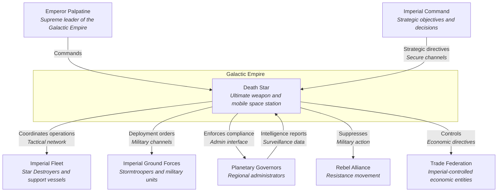
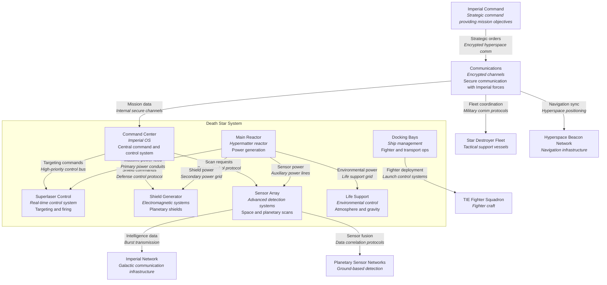

# 3. Context and Scope

## Overview

This section defines the boundaries of the Death Star system, identifying its external communication partners and interfaces. It distinguishes between the business context (domain-specific interactions) and the technical context (communication protocols, channels, hardware).

## Business Context

The Death Star interacts with multiple external systems and entities, each fulfilling a unique role. These include:
- **Imperial Command**: Provides mission objectives, tactical decisions, and security protocols.
- **Fleet and Ground Troops**: Coordinate for operational support, logistics, and deployment of resources.
- **Planetary Governors**: Interfaces for jurisdictional authority, surveillance, and control.

### Business Context Diagram

The diagram illustrates the high-level business interactions between the Death Star and key stakeholders in the Galactic Empire. The Death Star serves as the central enforcement mechanism for Imperial power, receiving strategic direction from the Emperor and Imperial Command while coordinating with various Imperial forces and governing bodies.

## Technical Context

The technical context focuses on the interfaces, protocols, and communication channels necessary for the Death Star to interact with its environment. This includes:
- **Data Transmission**: Secure channels for command and control from Imperial Command.
- **Weapon Systems**: Interfaces for targeting, power distribution, and firing control.
- **Sensor Arrays**: Continuous monitoring of surrounding space and planetary bodies.

### Technical Context Diagram

The technical context diagram shows the Death Star's internal systems and their interactions with external technical infrastructure. The massive power core feeds energy to all major systems, while the command center orchestrates operations. The communications system serves as the primary interface with the Imperial network and supporting forces.

## Motivation

Understanding the business and technical context ensures that all external dependencies are managed, and the Death Star's interactions with other systems are seamless. Proper documentation of these interfaces is critical to avoid miscommunication or failure in high-stakes situations.
