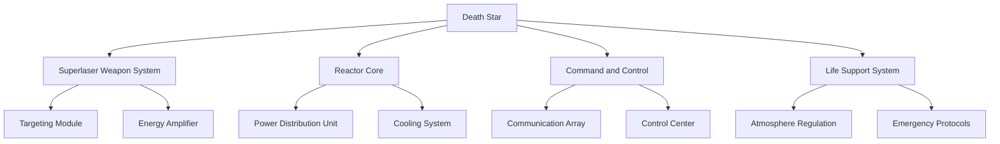

# 5. Building Block View

## Overview

The Building Block View provides a static decomposition of the Death Star system, showing the hierarchical structure of its components. This section breaks down the Death Star into manageable "white boxes" (high-level components) that contain "black boxes" (subcomponents) and describes how these elements are organized.

## Top-Level Components

1. **Superlaser Weapon System**: Responsible for targeting and firing at planetary objects.
   - *Targeting Module*: Calculates trajectories and impact points.
   - *Energy Amplifier*: Enhances reactor output to power the superlaser.
2. **Reactor Core**: Generates and distributes energy to all Death Star systems.
   - *Power Distribution Unit*: Manages energy flow to critical systems.
   - *Cooling System*: Prevents overheating during high-energy operations.
3. **Command and Control**: Oversees navigation, communication, and command hierarchy.
   - *Communication Array*: Handles internal and external communications.
   - *Control Center*: Monitors all systems and makes real-time adjustments.
4. **Life Support System**: Ensures survival conditions for personnel aboard the Death Star.
   - *Atmosphere Regulation*: Controls oxygen and other atmospheric conditions.
   - *Emergency Protocols*: Activates in the event of onboard hazards.

## Building Block Diagram

The following diagram shows the hierarchical decomposition of the Death Star into its main building blocks and their subcomponents.

## Motivation

Decomposing the Death Star’s architecture into building blocks allows for better modularity, maintainability, and scalability. By organizing systems into clear hierarchical structures, it becomes easier to manage and update individual components without disrupting the entire system.
