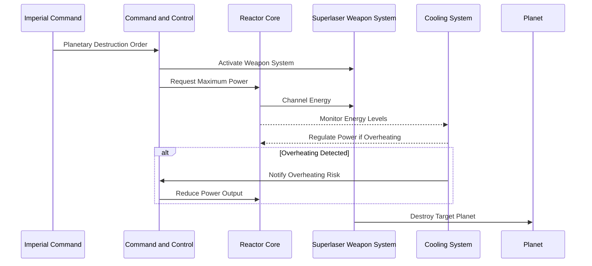
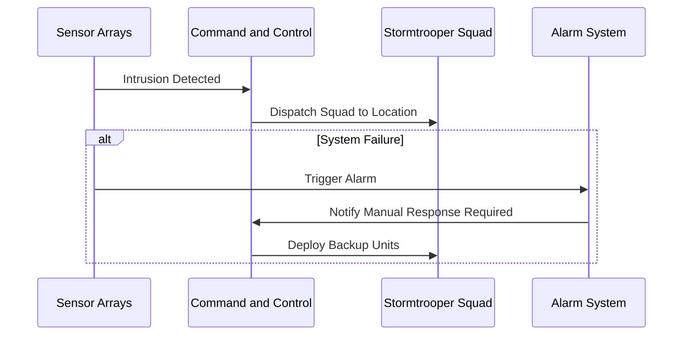

# 6. Runtime View

## Overview

The Runtime View describes the dynamic behavior and interactions of the Death Star’s building blocks during key scenarios. This view showcases how components work together to handle important use cases, operational processes, and error handling.

## Key Scenarios

1. **Planetary Destruction Sequence**
   - **Trigger**: Command from Imperial Command.
   - **Sequence**: The Command and Control system activates the Superlaser Weapon System. The Reactor Core channels power to the Energy Amplifier, which enables the superlaser to target and destroy the designated planet.
   - **Error Handling**: If energy output exceeds safe limits, the Cooling System regulates power flow to prevent overheating.
   - **Sequence Diagram**:

2. **Intruder Detection and Response**
   - **Trigger**: Detection of unauthorized presence via Sensor Arrays.
   - **Sequence**: The system alerts Command and Control, which dispatches Stormtroopers to the intruder’s location.
   - **Error Handling**: In case of system failure, an alarm is triggered, and backup units are deployed manually.
   - **Sequence Diagram**:

3. **Hyperdrive Activation and Navigation**
   - **Trigger**: Command from Navigation Control to relocate the Death Star.
   - **Sequence**: The Reactor Core redirects power to the Hyperdrive, while Navigation systems coordinate with Command and Control to ensure safe travel through hyperspace.
   - **Error Handling**: If navigation fails, power is diverted back to other systems, and Command initiates backup navigation protocols.
   - **Sequence Diagram**:

## Motivation

This view is essential for understanding the dynamic interactions within the Death Star, particularly during mission-critical operations. By documenting these scenarios, we ensure smooth execution and quick troubleshooting during complex processes.
