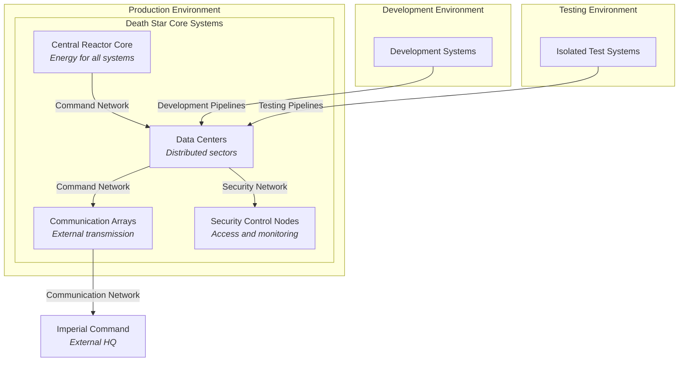

# 7. Deployment View

## Overview

The Deployment View describes the technical infrastructure necessary to execute the Death Star's systems, including the hardware components, geographical distribution, network topology, and computing environments. This section also shows how software components are mapped to the infrastructure elements.

## Environments

The Death Star operates in several distinct environments to ensure efficiency, security, and redundancy:
- **Development**: Used by engineers to test and update systems before deployment.
- **Testing**: Isolated environment for rigorous testing to avoid impacting operational systems.
- **Production**: The main operational environment where all systems are active and ready for Imperial command.
> **Note:**  
> Development, Testing, and Production environments share the same physical datacenter. Isolation is enforced through logical separation, not separate hardware installations.

## Key Infrastructure Components

1. **Central Reactor Core**: Provides energy for all systems, located at the center of the Death Star.
2. **Data Centers**: Distributed across multiple sectors to manage data and communication.
3. **Communication Arrays**: Positioned on the exterior for secure transmission with Imperial Command.
4. **Security Control Nodes**: Manage access and monitor activity throughout the station.

## Network Topology

The Death Star's internal network is organized to ensure secure and efficient data flow:
- **Command Network**: Connects central command with critical systems like the superlaser and reactor core.
- **Security Network**: Manages surveillance and security control nodes.
- **Communication Network**: Dedicated for external transmissions and internal status reports.

### Diagram

## Motivation

This deployment structure supports high performance, security, and fault tolerance, essential for the Death Star’s operational stability. By separating networks and defining environments, the architecture ensures that each system can function independently and maintain resilience.
