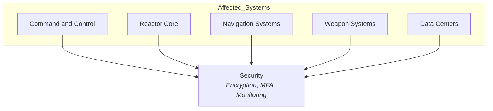
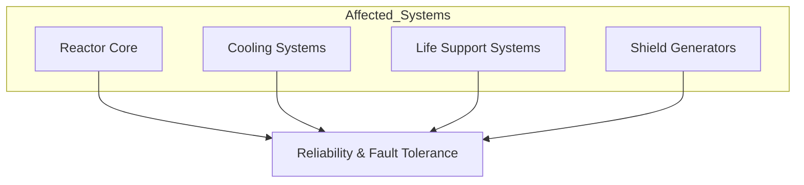
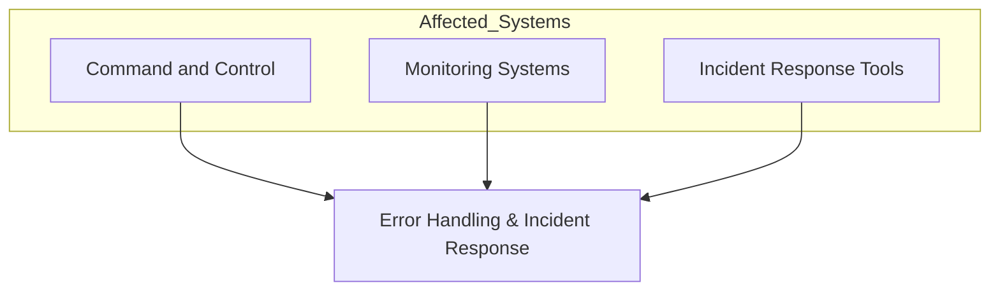
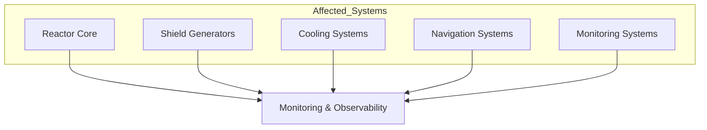
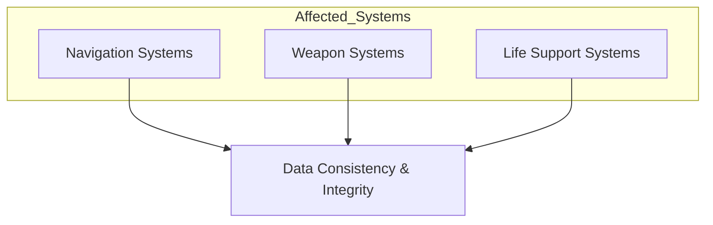
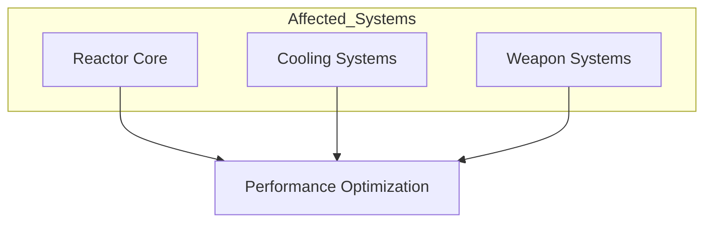
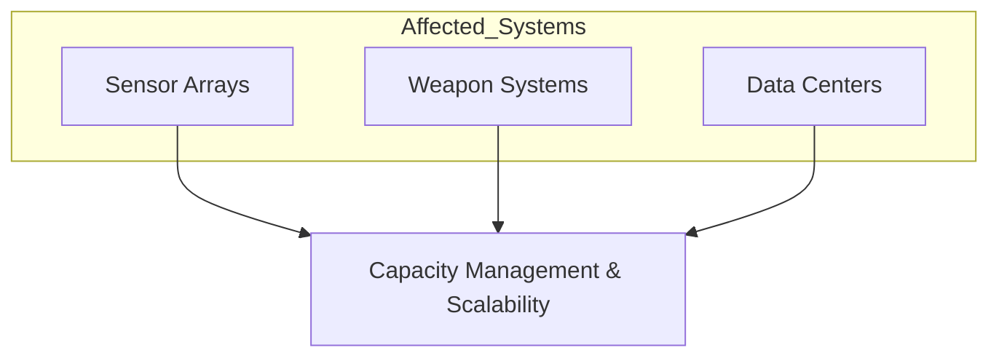
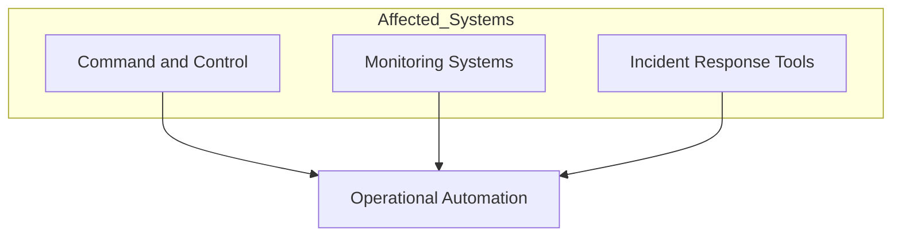
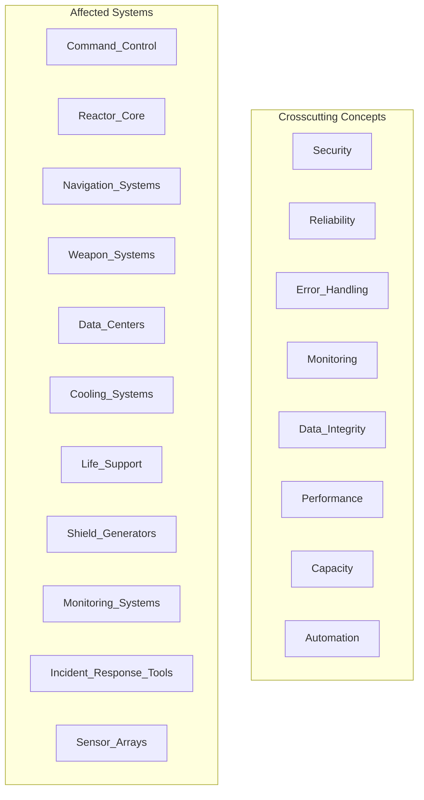

# 8. Crosscutting Concepts

## Overview

Crosscutting concepts define technical standards, principles, and solutions applied throughout the Death Star's architecture. These principles affect multiple components or layers, ensuring a unified approach to technical practices and enhancing the system's resilience, security, and operational stability.

## Key Crosscutting Concepts

### 1. **Security**

Stringent security protocols control access to critical systems. These include encryption for communications, multi-factor authentication for personnel, and continuous monitoring to detect unauthorized access attempts. Security applies across all layers to protect the station from internal and external threats.

### 2. **Reliability and Fault Tolerance**

Designed with redundancy in critical systems (e.g., reactor cooling and life support), the Death Star can handle component failures without disrupting operations. Key systems employ automatic failover, and backup resources are allocated to ensure mission continuity.

### 3. **Error Handling and Incident Response**

A standardized approach to error handling, logging, and incident response ensures immediate action during malfunctions. Errors are logged and monitored in real-time, and alerts are sent to Command and Control, allowing for rapid diagnosis and troubleshooting.

### 4. **Monitoring and Observability**

Proactive monitoring provides full visibility into the Death Star's core systems. Real-time dashboards monitor the health, performance, and status of all components, and critical metrics (e.g., reactor temperature, shield integrity) are tracked continuously. Observability mechanisms allow Command to detect issues before they escalate.

### 5. **Data Consistency and Integrity**

Systems maintain data consistency across all subsystems, particularly for navigation, targeting, and life support. Regular data integrity checks and synchronizations prevent conflicts and ensure accurate information flow across interconnected systems.

### 6. **Performance Optimization**

Core systems are optimized for high efficiency, especially energy management, cooling systems, and resource allocation. Performance is continuously measured, and critical components are periodically tested under stress to ensure stability during high-load scenarios.

### 7. **Capacity Management and Scalability**

Designed for scalability, the Death Star’s architecture can expand certain systems (such as sensor arrays or weapons modules) and replace modular components as needed. Capacity planning ensures that all systems operate within safe thresholds.

### 8. **Operational Automation**

Automation scripts and tools handle routine tasks like system updates, security patches, and resource allocation. Automated responses to incidents reduce manual intervention, allowing the team to focus on mission-critical objectives.

## Consolidated Crosscutting Concepts View

The following diagram provides a high-level overview of all affected systems and crosscutting concepts defined in this architecture. It serves as a visual summary, grouping key system components alongside the core technical principles that apply across the Death Star’s architecture.

> To maintain clarity and readability, individual relationships and links between systems and concepts are documented in detail within each specific crosscutting concept section, and are intentionally omitted here. This diagram is intended as a structural reference rather than an exhaustive dependency map.

## Motivation

Crosscutting concepts establish a cohesive approach to technical standards and design practices, enhancing the overall resilience, security, and reliability of the Death Star. Adopting these principles allows for consistent operation, faster response to issues, and alignment with long-term objectives of the Galactic Empire.

> Ownership and enforcement of these crosscutting concepts fall under the Galactic Empire’s Technical Command, ensuring governance and continuous improvement across all Death Star systems.