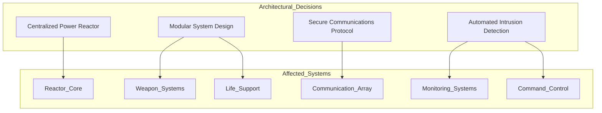

# 9. Architectural Decisions

## Overview

This section documents the critical architectural decisions that have shaped the Death Star’s design and functionality. Each decision includes its context, the options considered, the final choice, and the reasoning behind it. These decisions are significant due to their impact on overall functionality, performance, or security.

## Key Architectural Decisions

1. **Centralized Power Reactor**: 
   - **Context**: The Death Star requires immense energy to power its superlaser.
   - **Options**: Multiple smaller reactors versus a single centralized reactor.
   - **Decision**: Use a **single central reactor** to streamline energy management and amplification for the superlaser.
   - **Rationale**: A single reactor allows for efficient energy control and simplifies system integration. However, **it introduces a critical single point of failure**: if the reactor is compromised, the entire station becomes inoperative.

   > ⚠️ This risk is explicitly analyzed in Section 11: [Risks and Technical Debt](./11_risks_and_technical_debt.md).

2. **Modular Design for Weapon and Life Support Systems**:
   - **Context**: The need to isolate high-risk systems like weaponry and critical systems like life support.
   - **Options**: Fully integrated design versus modular system separation.
   - **Decision**: Adopt a modular design to ensure that a failure in one system (e.g., weapons) does not compromise other critical areas.
   - **Rationale**: This decision enhances fault tolerance and facilitates easier upgrades and maintenance.

3. **Secure Communications Protocol**:
   - **Context**: Communication across vast distances between the Death Star and Imperial Command.
   - **Options**: Standardized protocols versus a proprietary, encrypted protocol.
   - **Decision**: Implement a proprietary, high-security protocol for all transmissions.
   - **Rationale**: Ensures secure communications, safeguarding sensitive information from potential Rebel interception.

4. **Automated Intrusion Detection System**:
   - **Context**: High risk of Rebel infiltrations or sabotage.
   - **Options**: Manual security monitoring versus automated intrusion detection.
   - **Decision**: Use an automated system for detecting and responding to unauthorized access attempts.
   - **Rationale**: Automation enables faster response times, reducing risk from internal and external threats.

## Decision Impact Overview Diagram
The following diagram summarizes which key systems are directly impacted by each architectural decision:

### Decision Summary Table

| ID | Decision Title                           | Status | Impact Level | Affected Systems                    |
| -- | ---------------------------------------- | ------ | ------------ | ----------------------------------- |
| 1  | Centralized Power Reactor                | Active | Critical     | Reactor Core                        |
| 2  | Modular Design for Weapon & Life Support | Active | High         | Weapon Systems, Life Support        |
| 3  | Secure Communications Protocol           | Active | High         | Communication Array                 |
| 4  | Automated Intrusion Detection            | Active | Medium       | Monitoring Systems, Command Control |

## Motivation

Documenting these architectural decisions provides a clear understanding of the choices that guide the Death Star’s structure and functionality. This documentation ensures continuity in design and informs future development or modifications to maintain alignment with initial objectives.

> ## NOTE ABOUT ADR:
>
> The decisions documented here follow the Architectural Decision Record (ADR) format, a practice formalized within the Galactic Empire’s technical doctrine.
> 
> Historically, ADRs have been essential for maintaining continuity across Imperial engineering projects, from the Death Star to planetary shield systems on Scarif and Hoth.
> 
> For more about ADRs:
> 
> - [Michael Nygard – Documenting Architecture Decisions](https://cognitect.com/blog/2011/11/15/documenting-architecture-decisions.html)
> - [ADR GitHub Template Repository](https://github.com/joelparkerhenderson/architecture-decision-record)