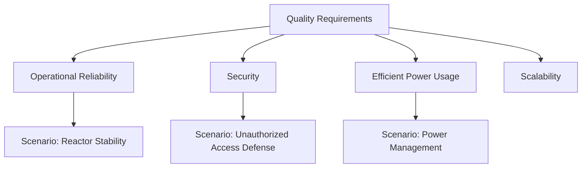
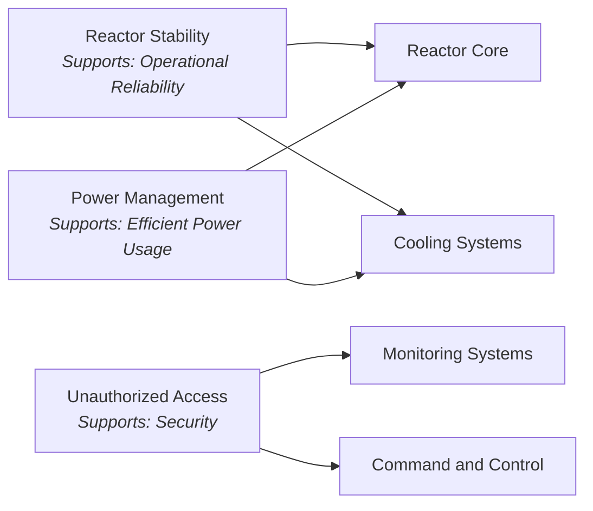

# 10. Quality Requirements

## Overview

This section outlines the primary quality requirements for the Death Star’s architecture, focusing on the performance, security, and reliability metrics that are essential for its operation. The following quality goals and scenarios serve as benchmarks to guide architectural decisions and system improvements.

## Quality Goals

1. **High Operational Reliability**: The Death Star must function seamlessly without interruptions during missions, ensuring continuous availability of critical systems.
2. **Enhanced Security**: Prevent unauthorized access to core systems and safeguard sensitive data from Rebel interception.
3. **Efficient Power Usage**: Minimize energy waste to support extended missions and prevent overheating during high-energy operations.
4. **Scalability**: Allow modular upgrades, especially for weaponry and defense systems, to adapt to future needs and technologies.

## Quality Scenarios

### Scenario 1: Reactor Stability During Extended Operation
   - **Trigger**: Continuous operation of the reactor for over 24 hours during a mission.
   - **Expected Outcome**: The cooling system manages temperature effectively, and the reactor maintains stable output without failure.
   - **Metric**: Reactor operates within safe temperature limits, ensuring system reliability.

### Scenario 2: Defense Against Unauthorized Access
   - **Trigger**: Attempted unauthorized access to critical systems.
   - **Expected Outcome**: Access is denied, an alert is sent to Command and Control, and the intruder is logged and monitored.
   - **Metric**: 100% detection rate of unauthorized access attempts, with real-time alerts.

### Scenario 3: Power Management Under High Load
   - **Trigger**: Activation of multiple high-energy systems, including the superlaser and shield generators.
   - **Expected Outcome**: Power distribution is balanced, with priority given to mission-critical systems.
   - **Metric**: Energy usage remains within operational thresholds, avoiding any system overloads.

## Quality Tree Diagram

The following diagram illustrates the relationship between the Death Star’s quality goals and the key quality scenarios:

## Quality Scenario/System Impact Diagram

The following diagram shows which systems are directly involved in supporting each quality scenario:

## Motivation

By defining these quality requirements, the architecture of the Death Star is guided towards reliable, secure, and efficient operations. Clear quality benchmarks ensure that each system component aligns with the overarching mission objectives and can perform under demanding conditions.
