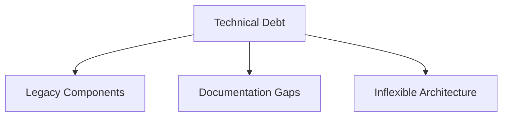

# 11. Risks and Technical Debt

## Overview

This section outlines known risks and technical debt within the Death Star architecture. Identifying and documenting these risks enables proactive planning to mitigate potential issues that could impact the system’s long-term performance, security, and reliability.

## Key Risks

1. **Reactor Core Vulnerability**
   - **Description**: The single central reactor, while efficient, presents a **single point of failure**. An attack targeting this area could lead to catastrophic outcomes.
   - **Mitigation**: Implement enhanced shielding and compartmentalization around the reactor core to protect against direct strikes.

2. **Potential for Unauthorized Access**
   - **Description**: The complexity of the Death Star’s security protocols may contain overlooked vulnerabilities, which could be exploited by skilled intruders.
   - **Mitigation**: Conduct regular security audits and enhance monitoring to detect any suspicious activity promptly.

3. **System Overload During High-Energy Operations**
   - **Description**: Simultaneous operation of high-energy components, such as the superlaser and shield generators, could overload the power distribution system.
   - **Mitigation**: Establish a power management protocol that prioritizes energy allocation to mission-critical systems.

4. **Data Synchronization and Consistency Issues**
   - **Description**: With multiple subsystems operating simultaneously, data synchronization challenges could lead to discrepancies that impact decision-making.
   - **Mitigation**: Regularly test data synchronization protocols and employ redundancy mechanisms to ensure data integrity across systems.

### Risk Summary Table
| ID | Risk Title                             | Impact Level | Affected Systems          | Mitigation Strategy                         |
| -- | -------------------------------------- | ------------ | ------------------------- | ------------------------------------------- |
| R1 | Reactor Core Vulnerability             | 🔴 Critical  | Reactor Core              | Enhanced shielding and compartmentalization |
| R2 | Potential for Unauthorized Access      | 🟠 High      | Security Systems          | Regular audits and real-time monitoring     |
| R3 | System Overload During High-Energy Ops | 🟠 High      | Power Distribution System | Power prioritization protocol               |
| R4 | Data Synchronization Issues            | 🟡 Medium    | Data Services             | Regular testing and redundancy mechanisms   |

## Technical Debt

The following structural areas of technical debt have been identified:

| ID  | Category                  | Description                                                              | Impact Level | Suggested Action                         |
|-----|--------------------------|--------------------------------------------------------------------------|--------------|------------------------------------------|
| TD1 | Legacy Components        | Older subsystems complicate integration and degrade performance          | 🟠 High      | Plan phased refactoring and replacement  |
| TD2 | Documentation Gaps       | Incomplete or outdated documentation slows maintenance and onboarding    | 🟡 Medium    | Establish documentation review cycles    |
| TD3 | Inflexible Architecture  | Rigid module structures limit scalability and adaptability               | 🟠 High      | Redesign critical modules for modularity |

## Technical Debt Map

## Motivation

Documenting risks and technical debt ensures that known challenges are visible to all stakeholders. By addressing these issues proactively, the Death Star’s architecture can be better prepared to maintain reliability, security, and adaptability in future missions.

> This technical debt register focuses on structural and systemic issues rather than minor implementation-level concerns. It is maintained as part of the Death Star’s long-term architecture governance, overseen by the Galactic Empire’s Technical Command.