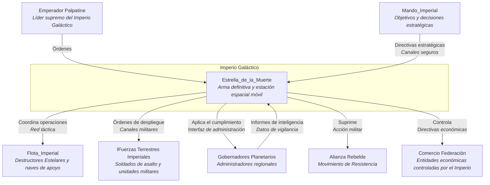
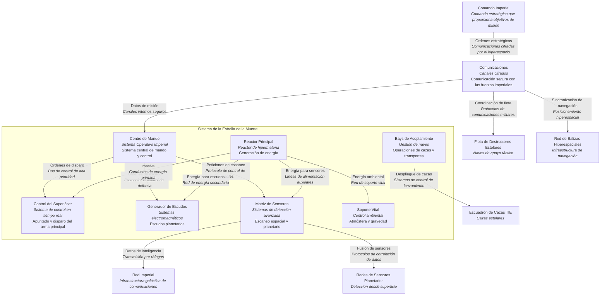

# 3. Contexto y Alcance

## Descripción General

Esta sección define los límites del sistema de la Estrella de la Muerte, identificando sus socios de comunicación externos e interfaces. Distingue entre el contexto de negocio (interacciones específicas del dominio) y el contexto técnico (protocolos de comunicación, canales, hardware).

## Contexto de Negocio

La Estrella de la Muerte interactúa con múltiples sistemas y entidades externas, cada una cumpliendo un rol único. Estas incluyen:
- **Comando Imperial**: Proporciona objetivos de misión, decisiones tácticas y protocolos de seguridad.
- **Flota y Tropas Terrestres**: Coordinación para soporte operativo, logística y despliegue de recursos.
- **Gobernadores Planetarios**: Interfaces para autoridad jurisdiccional, vigilancia y control.

### Diagrama de Contexto de Negocio

## Contexto Técnico

El contexto técnico se centra en las interfaces, protocolos y canales de comunicación necesarios para que la Estrella de la Muerte interactúe con su entorno. Esto incluye:
- **Transmisión de Datos**: Canales seguros para el mando y control desde el Comando Imperial.
- **Sistemas de Armas**: Interfaces para control de objetivos, distribución de energía y control de disparo.
- **Sistemas de Sensores**: Monitoreo continuo del espacio circundante y cuerpos planetarios.

### Diagrama de Contexto Técnico

## Motivación

Comprender el contexto de negocio y técnico asegura que todas las dependencias externas estén gestionadas y que las interacciones de la Estrella de la Muerte con otros sistemas sean fluidas. La documentación adecuada de estas interfaces es crítica para evitar malentendidos o fallos en situaciones de alta importancia.
