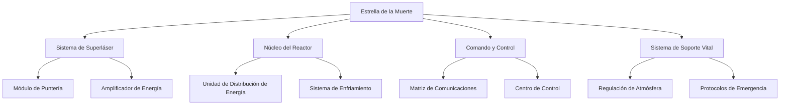

# 5. Vista de Bloques de Construcción

## Descripción General

La Vista de Bloques de Construcción proporciona una descomposición estática del sistema de la Estrella de la Muerte, mostrando la estructura jerárquica de sus componentes. Esta sección desglosa la Estrella de la Muerte en "cajas blancas" (componentes de alto nivel) que contienen "cajas negras" (subcomponentes) y describe cómo se organizan estos elementos.

## Componentes de Alto Nivel

1. **Sistema de Superláser**: Responsable de apuntar y disparar contra objetos planetarios.
   - *Módulo de Apuntado*: Calcula trayectorias y puntos de impacto.
   - *Amplificador de Energía*: Aumenta la salida del reactor para alimentar el superláser.
2. **Núcleo del Reactor**: Genera y distribuye energía a todos los sistemas de la Estrella de la Muerte.
   - *Unidad de Distribución de Energía*: Gestiona el flujo de energía a sistemas críticos.
   - *Sistema de Enfriamiento*: Previene el sobrecalentamiento durante operaciones de alta energía.
3. **Comando y Control**: Supervisa la navegación, comunicación y jerarquía de mando.
   - *Matriz de Comunicación*: Maneja comunicaciones internas y externas.
   - *Centro de Control*: Monitorea todos los sistemas y realiza ajustes en tiempo real.
4. **Sistema de Soporte Vital**: Garantiza condiciones de supervivencia para el personal a bordo de la Estrella de la Muerte.
   - *Regulación de Atmósfera*: Controla el oxígeno y otras condiciones atmosféricas.
   - *Protocolos de Emergencia*: Se activan en caso de riesgos a bordo.

## Diagrama de Bloques de Construcción

El siguiente diagrama muestra la descomposición jerárquica de la Estrella de la Muerte en sus principales bloques de construcción y sus subcomponentes.

## Motivación

Descomponer la arquitectura de la Estrella de la Muerte en bloques de construcción permite una mejor modularidad, mantenibilidad y escalabilidad. Al organizar los sistemas en estructuras jerárquicas claras, es más fácil gestionar y actualizar componentes individuales sin interrumpir el sistema completo.
