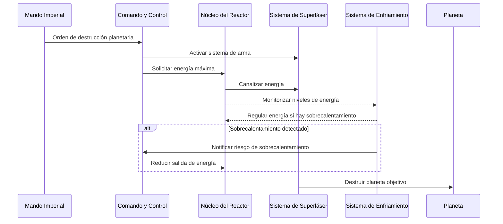
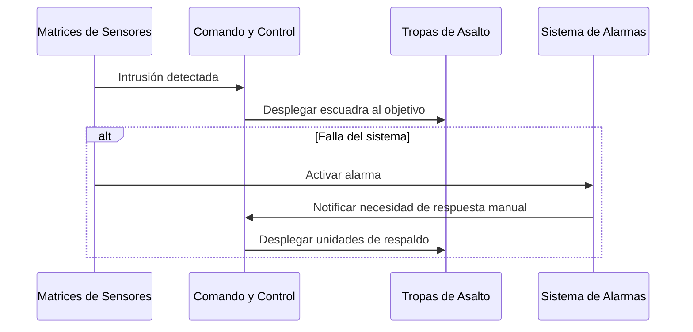
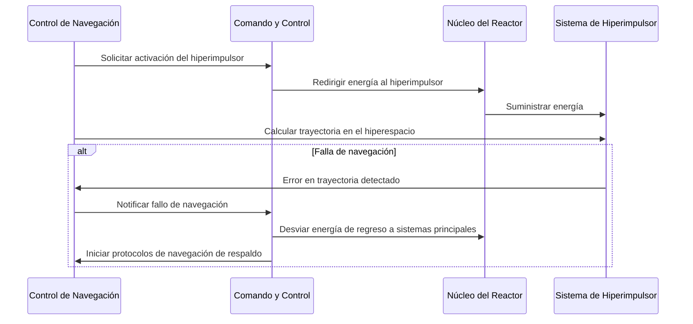

# 6. Vista de Tiempo de Ejecución

## Descripción General

La Vista de Tiempo de Ejecución describe el comportamiento dinámico y las interacciones de los bloques de construcción de la Estrella de la Muerte durante escenarios clave. Esta vista muestra cómo los componentes trabajan juntos para manejar casos de uso importantes, procesos operativos y gestión de errores.

## Escenarios Clave

1. **Secuencia de Destrucción Planetaria**
   - **Desencadenante**: Orden del Comando Imperial.
   - **Secuencia**: El sistema de Comando y Control activa el Sistema de Superláser. El Núcleo del Reactor canaliza energía al Amplificador de Energía, lo que permite al superláser apuntar y destruir el planeta designado.
   - **Gestión de Errores**: Si la salida de energía supera los límites seguros, el Sistema de Enfriamiento regula el flujo de energía para evitar el sobrecalentamiento.
   - **Diagrama de sequencia**:

2. **Detección y Respuesta ante Intrusos**
   - **Desencadenante**: Detección de presencia no autorizada a través de Matrices de Sensores.
   - **Secuencia**: El sistema alerta a Comando y Control, que envía tropas de asalto a la ubicación del intruso.
   - **Gestión de Errores**: En caso de fallo del sistema, se activa una alarma y se despliegan unidades de respaldo manualmente.
   - **Diagrama de sequencia**:

3. **Activación del Hiperimpulsor y Navegación**
   - **Desencadenante**: Orden de Control de Navegación para reubicar la Estrella de la Muerte.
   - **Secuencia**: El Núcleo del Reactor redirige energía al Hiperimpulsor, mientras que los sistemas de Navegación coordinan con Comando y Control para garantizar un viaje seguro a través del hiperespacio.
   - **Gestión de Errores**: Si la navegación falla, la energía se desvía de regreso a otros sistemas, y el Comando inicia protocolos de navegación de respaldo.
   - **Diagrama de sequencia**:

## Motivación

Esta vista es esencial para comprender las interacciones dinámicas dentro de la Estrella de la Muerte, especialmente durante operaciones críticas. Al documentar estos escenarios, garantizamos una ejecución fluida y una rápida solución de problemas durante procesos complejos.
