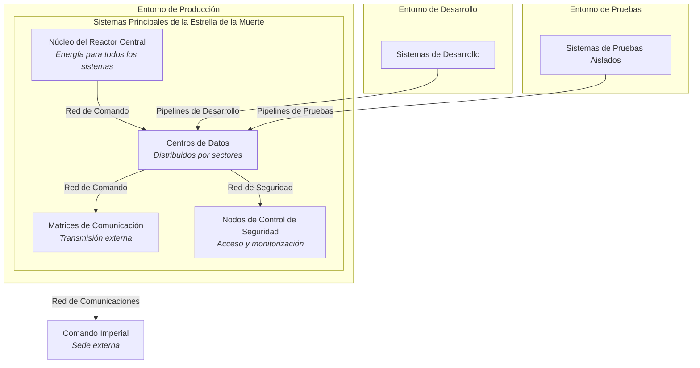

# 7. Vista de Despliegue

## Descripción General

La Vista de Despliegue describe la infraestructura técnica necesaria para ejecutar los sistemas de la Estrella de la Muerte, incluyendo los componentes de hardware, distribución geográfica, topología de red y entornos de cómputo. Esta sección también muestra cómo los componentes de software se asignan a los elementos de infraestructura.

## Entornos

La Estrella de la Muerte opera en varios entornos distintos para garantizar eficiencia, seguridad y redundancia:
- **Desarrollo**: Utilizado por ingenieros para probar y actualizar sistemas antes del despliegue.
- **Pruebas**: Entorno aislado para pruebas rigurosas sin afectar los sistemas operativos.
- **Producción**: El entorno operativo principal donde todos los sistemas están activos y listos para el mando imperial.
> **Nota:**  
> Los entornos de Desarrollo, Pruebas y Producción comparten el mismo centro de datos físico. La separación se garantiza de forma lógica, no mediante instalaciones de hardware independientes.

## Componentes Clave de Infraestructura

1. **Núcleo del Reactor Central**: Proporciona energía para todos los sistemas, ubicado en el centro de la Estrella de la Muerte.
2. **Centros de Datos**: Distribuidos en múltiples sectores para gestionar datos y comunicaciones.
3. **Matriz de Comunicaciones**: Ubicada en el exterior para transmisiones seguras con el Comando Imperial.
4. **Nodos de Control de Seguridad**: Gestionan el acceso y monitorean la actividad en toda la estación.

## Topología de Red

La red interna de la Estrella de la Muerte está organizada para garantizar un flujo de datos seguro y eficiente:
- **Red de Comando**: Conecta el comando central con sistemas críticos como el superláser y el núcleo del reactor.
- **Red de Seguridad**: Gestiona la vigilancia y los nodos de control de seguridad.
- **Red de Comunicaciones**: Dedicada a transmisiones externas e informes de estado internos.

### Diagrama

## Motivación

Esta estructura de despliegue respalda el alto rendimiento, la seguridad y la tolerancia a fallos, esenciales para la estabilidad operativa de la Estrella de la Muerte. Al separar redes y definir entornos, la arquitectura asegura que cada sistema pueda funcionar de manera independiente y mantener su resiliencia.
