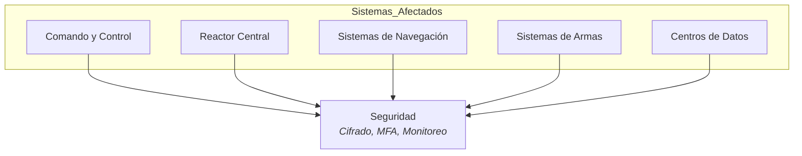
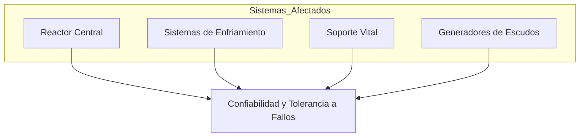
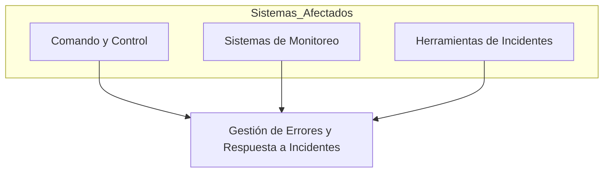
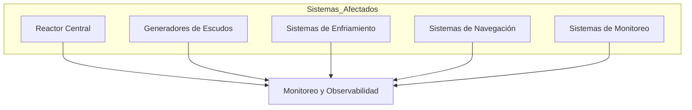
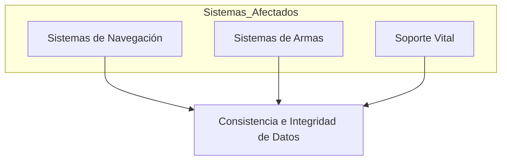
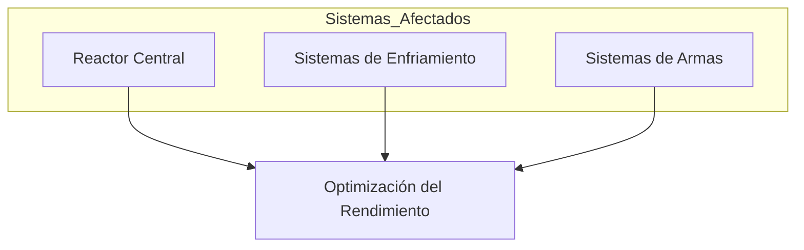
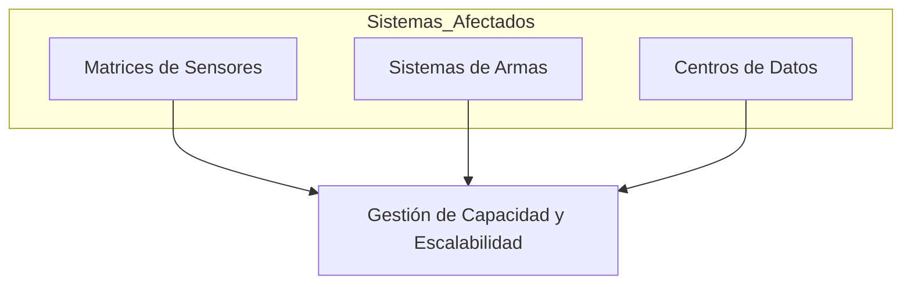
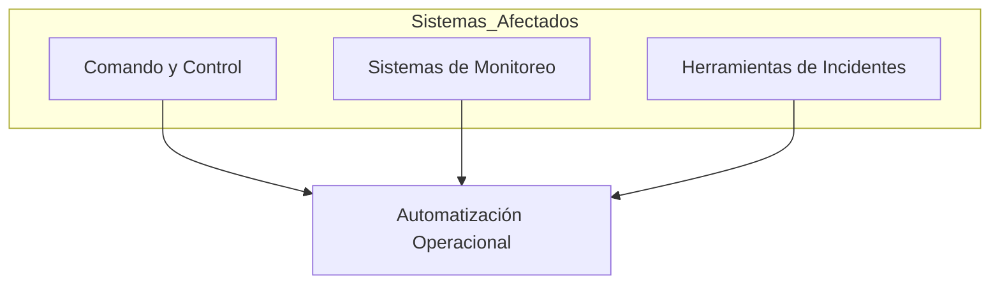
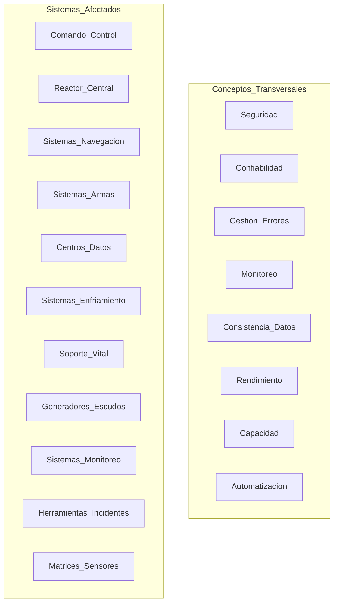

# 8. Conceptos Transversales

## Descripción General

Los conceptos transversales definen los estándares técnicos, principios y soluciones aplicados en toda la arquitectura de la Estrella de la Muerte. Estos principios afectan a múltiples componentes o capas, asegurando un enfoque unificado en las prácticas técnicas y mejorando la resiliencia, seguridad y estabilidad operativa del sistema.

## Principales Conceptos Transversales

### 1. **Seguridad**

Protocolos estrictos controlan el acceso a sistemas críticos. Esto incluye cifrado de comunicaciones, autenticación multifactor para el personal y monitoreo continuo para detectar intentos de acceso no autorizados. La seguridad se integra en cada capa para proteger la estación de amenazas internas y externas.

### 2. **Confiabilidad y Tolerancia a Fallos**

Diseñada con redundancia en sistemas críticos (por ejemplo, enfriamiento del reactor y soporte vital), la Estrella de la Muerte puede manejar fallos de componentes sin interrumpir las operaciones. Los sistemas clave emplean conmutación por error automática y se asignan recursos de respaldo para garantizar la continuidad de la misión.

### 3. **Gestión de Errores y Respuesta a Incidentes**

Un enfoque estandarizado para la gestión de errores, registro y respuesta a incidentes asegura una acción inmediata en caso de fallos. Los errores se registran y monitorean en tiempo real, y las alertas se envían a Comando y Control, permitiendo un diagnóstico y solución rápidos.

### 4. **Monitoreo y Observabilidad**

El monitoreo proactivo proporciona visibilidad total de los sistemas principales de la Estrella de la Muerte. Los paneles de control en tiempo real monitorean la salud, rendimiento y estado de todos los componentes, y se rastrean métricas críticas (p. ej., temperatura del reactor, integridad de escudos) de manera continua. Los mecanismos de observabilidad permiten a Comando detectar problemas antes de que se intensifiquen.

### 5. **Consistencia e Integridad de Datos**

Los sistemas mantienen consistencia de datos en todos los subsistemas, particularmente en navegación, puntería y soporte vital. Verificaciones de integridad y sincronizaciones regulares evitan conflictos y aseguran un flujo de información preciso en sistemas interconectados.

### 6. **Optimización del Rendimiento**

Los sistemas principales están optimizados para alta eficiencia, especialmente en gestión de energía, sistemas de enfriamiento y asignación de recursos. El rendimiento se mide continuamente, y los componentes críticos se someten a pruebas de estrés periódicas para asegurar estabilidad durante escenarios de alta carga.

### 7. **Gestión de Capacidad y Escalabilidad**

La arquitectura de la Estrella de la Muerte está diseñada para escalabilidad, permitiendo expandir ciertos sistemas (como matrices de sensores o módulos de armas) y reemplazar componentes modulares según sea necesario. La planificación de capacidad asegura que todos los sistemas operen dentro de umbrales seguros.

### 8. **Automatización Operacional**

Scripts y herramientas de automatización manejan tareas rutinarias como actualizaciones de sistemas, parches de seguridad y asignación de recursos. Las respuestas automáticas a incidentes reducen la intervención manual, permitiendo que el equipo se enfoque en objetivos críticos de misión.

## Vista Consolidada de Conceptos Transversales
El siguiente diagrama proporciona una visión de alto nivel de todos los sistemas afectados y los conceptos transversales definidos en esta arquitectura. Sirve como un resumen visual estructurado, agrupando los componentes clave del sistema junto a los principios técnicos que se aplican de forma transversal en la Estrella de la Muerte.

> Para mantener claridad y legibilidad, las relaciones específicas entre sistemas y conceptos se documentan en detalle dentro de cada sección individual y se omiten intencionadamente aquí. Este diagrama se utiliza como referencia estructural, no como un mapa de dependencias exhaustivo.

## Motivación

Los conceptos transversales establecen un enfoque coherente en estándares técnicos y prácticas de diseño, mejorando la resiliencia, seguridad y confiabilidad general de la Estrella de la Muerte. La adopción de estos principios permite operaciones consistentes, una respuesta rápida a problemas y alineación con los objetivos a largo plazo del Imperio Galáctico.

> La responsabilidad y supervisión de estos conceptos transversales recae en el Comando Técnico del Imperio Galáctico, garantizando la gobernanza y mejora continua en todos los sistemas de la Estrella de la Muerte.
