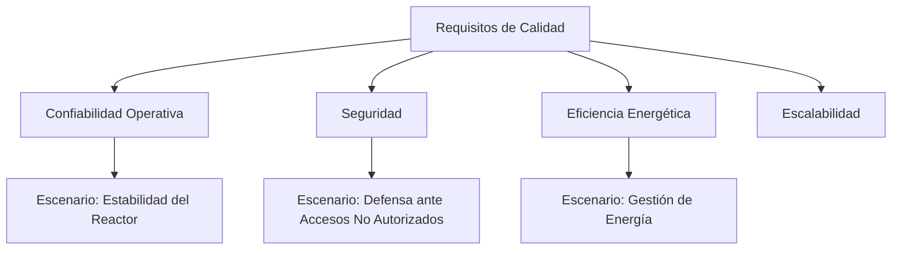
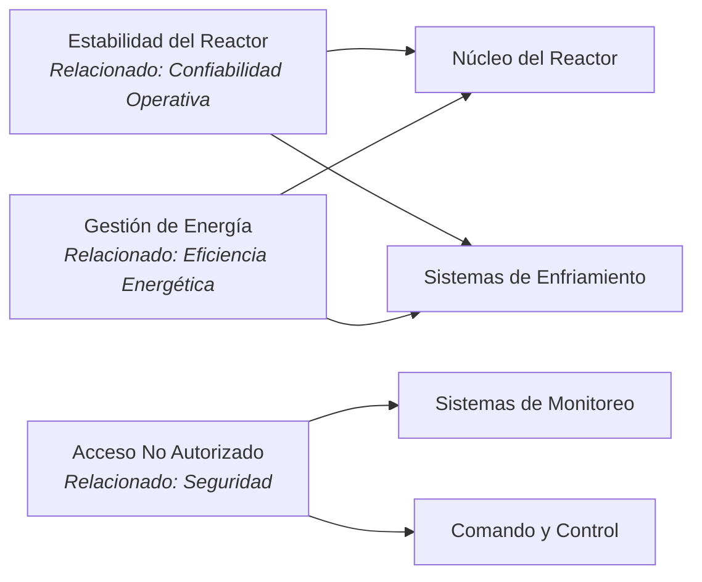

# 10. Requisitos de Calidad

## Descripción General

Esta sección detalla los requisitos de calidad principales para la arquitectura de la Estrella de la Muerte, con un enfoque en los estándares de rendimiento, seguridad y confiabilidad que son esenciales para su operación. Los siguientes objetivos de calidad y escenarios sirven como referencia para guiar las decisiones arquitectónicas y mejoras del sistema.

## Objetivos de Calidad

1. **Alta Confiabilidad Operativa**: La Estrella de la Muerte debe funcionar sin interrupciones durante las misiones, asegurando la disponibilidad continua de los sistemas críticos.
2. **Seguridad Mejorada**: Prevenir el acceso no autorizado a sistemas clave y proteger datos sensibles de posibles interceptaciones Rebeldes.
3. **Eficiencia en el Uso de Energía**: Minimizar el desperdicio de energía para soportar misiones prolongadas y evitar el sobrecalentamiento durante operaciones de alta energía.
4. **Escalabilidad**: Permitir actualizaciones modulares, especialmente en armamento y sistemas de defensa, para adaptarse a futuras necesidades y tecnologías.

## Escenarios de Calidad

### Escenario 1: Estabilidad del Reactor Durante Operaciones Prolongadas
   - **Desencadenante**: Operación continua del reactor por más de 24 horas durante una misión.
   - **Resultado Esperado**: El sistema de enfriamiento gestiona la temperatura de manera efectiva y el reactor mantiene una salida estable sin fallos.
   - **Métrica**: El reactor opera dentro de los límites seguros de temperatura, asegurando la confiabilidad del sistema.

### Escenario 2: Defensa Contra Acceso No Autorizado
   - **Desencadenante**: Intento de acceso no autorizado a sistemas críticos.
   - **Resultado Esperado**: Se deniega el acceso, se envía una alerta a Comando y Control, y el intruso es registrado y monitoreado.
   - **Métrica**: 100% de tasa de detección de intentos de acceso no autorizado, con alertas en tiempo real.

### Escenario 3: Gestión de Energía Bajo Carga Alta
   - **Desencadenante**: Activación de múltiples sistemas de alta energía, incluyendo el superláser y generadores de escudos.
   - **Resultado Esperado**: La distribución de energía se equilibra, priorizando los sistemas críticos para la misión.
   - **Métrica**: El uso de energía se mantiene dentro de los umbrales operativos, evitando sobrecargas en el sistema.

## Diagrama de Árbol de Calidad

El siguiente diagrama ilustra la relación entre los objetivos de calidad de la Estrella de la Muerte y los escenarios clave asociados:

## Diagrama de Impacto de Escenarios de Calidad en Sistemas

El siguiente diagrama muestra qué sistemas están directamente involucrados en el soporte de cada escenario de calidad:

## Motivación

Al definir estos requisitos de calidad, la arquitectura de la Estrella de la Muerte se orienta hacia operaciones confiables, seguras y eficientes. Los puntos de referencia de calidad claros aseguran que cada componente del sistema esté alineado con los objetivos de misión y pueda rendir bajo condiciones exigentes.
