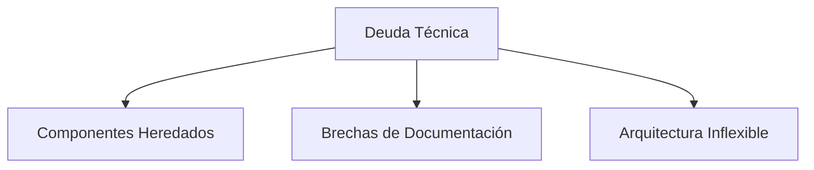

# 11. Riesgos y Deuda Técnica

## Descripción General

Esta sección detalla los riesgos conocidos y la deuda técnica dentro de la arquitectura de la Estrella de la Muerte. Identificar y documentar estos riesgos permite una planificación proactiva para mitigar posibles problemas que podrían afectar el rendimiento, la seguridad y la confiabilidad a largo plazo del sistema.

## Principales Riesgos

1. **Vulnerabilidad del Núcleo del Reactor**
   - **Descripción**: El reactor central, aunque eficiente, representa un **punto único de fallo**. Un ataque dirigido a esta área podría tener consecuencias catastróficas.
   - **Mitigación**: Implementar blindaje mejorado y compartimentación alrededor del núcleo del reactor para protegerlo contra ataques directos.

2. **Potencial de Acceso No Autorizado**
   - **Descripción**: La complejidad de los protocolos de seguridad de la Estrella de la Muerte podría contener vulnerabilidades pasadas por alto que pueden ser explotadas por intrusos expertos.
   - **Mitigación**: Realizar auditorías de seguridad periódicas y mejorar el monitoreo para detectar cualquier actividad sospechosa rápidamente.

3. **Sobrecarga del Sistema Durante Operaciones de Alta Energía**
   - **Descripción**: La operación simultánea de componentes de alta energía, como el superláser y los generadores de escudos, podría sobrecargar el sistema de distribución de energía.
   - **Mitigación**: Establecer un protocolo de gestión de energía que priorice la asignación a sistemas críticos para la misión.

4. **Problemas de Sincronización y Consistencia de Datos**
   - **Descripción**: Con múltiples subsistemas operando simultáneamente, los desafíos de sincronización de datos podrían llevar a discrepancias que afecten la toma de decisiones.
   - **Mitigación**: Probar regularmente los protocolos de sincronización de datos y emplear mecanismos de redundancia para asegurar la integridad de los datos en todos los sistemas.

### Risk Summary Table
| ID | Título del Riesgo                         | Nivel de Impacto | Sistemas Afectados                 | Estrategia de Mitigación                        |
| -- | ----------------------------------------- | ---------------- | ---------------------------------- | ----------------------------------------------- |
| R1 | Vulnerabilidad del Núcleo del Reactor     | 🔴 Crítico       | Núcleo del Reactor                 | Blindaje reforzado y compartimentación          |
| R2 | Potencial de Acceso No Autorizado         | 🟠 Alto          | Sistemas de Seguridad              | Auditorías regulares y monitoreo en tiempo real |
| R3 | Sobrecarga en Operaciones de Alta Energía | 🟠 Alto          | Sistema de Distribución de Energía | Protocolo de priorización energética            |
| R4 | Problemas de Sincronización de Datos      | 🟡 Medio         | Servicios de Datos                 | Pruebas periódicas y mecanismos de redundancia  |

## Deuda Técnica

Se han identificado las siguientes áreas estructurales de deuda técnica:

| ID | Categoría | Descripción | Nivel de Impacto | Acción Sugerida |
|-----|--------------------------|------------------------------------------------------------------------------------|------------------------|--------------------------------------------------------------------|
| TD1 | Componentes Heredados | Los subsistemas antiguos complican la integración y reducen el rendimiento | 🟠 Alto | Planificar la refactorización y el reemplazo por fases |
| TD2 | Brechas en la Documentación | La documentación incompleta u obsoleta ralentiza el mantenimiento y la incorporación | 🟡 Medio | Establecer ciclos de revisión de la documentación |
| TD3 | Arquitectura Inflexible | Las estructuras modulares rígidas limitan la escalabilidad y la adaptabilidad | 🟠 Alto | Rediseñar módulos críticos para lograr modularidad |

## Mapa de Deuda Técnica

## Motivación

Documentar los riesgos y la deuda técnica garantiza que los desafíos conocidos sean visibles para todas las partes interesadas. Al abordar estos problemas de manera proactiva, la arquitectura de la Estrella de la Muerte puede estar mejor preparada para mantener la confiabilidad, seguridad y adaptabilidad en misiones futuras.

> Este registro de deuda técnica se centra en problemas estructurales y sistémicos, en lugar de problemas menores de implementación. Se mantiene como parte de la gobernanza de la arquitectura a largo plazo de la Estrella de la Muerte, supervisada por el Comando Técnico del Imperio Galáctico.